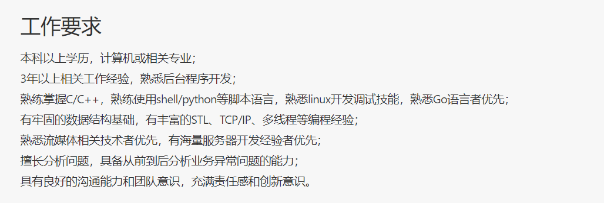

##### 为了工作所需要的技能栈

逐条分析

1. ###### c/c++.

   ​	c++复习书籍 : <<c++ primer>> <<effctive c++>> 以及其他很多(不列举).

   ​	还有一个改写c语言项目没有完成, 可能在返校以后继续参加.

2. ###### shell/python  

   ​	阅读<<鸟哥的linux私房菜>> python相应书籍

3. ###### linux开发技能  

   ​	gbd手册, <<linux系统编程手册>> unp, unpe (太厚太多了)

4. ###### Go

   ​	假期中要尽量完成一个go项目, 虽然目前老师那边没有召集的意思, 但估计很快就会开始, 估计这个会花去大部分时间

###### 	5. 数据结构

​			Leetcode刷起来, STL 尽量看

###### 	6. TCP/IP 多线程

​			<<Linux多线程服务器端开发>>  <<c++多线程开发实战>>  实现一个简单服务器

##### 寒假计划

​	上面的内容非常非常多, 我认为完成第四条Go的基本上会构成假期的主旋律. 具体计划暂且未定

第一周 : 完成了 project1 , 正在debug project2a